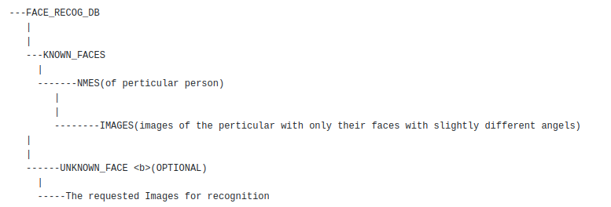

# Biometric attendance system CNN
Modern attendance System leveraging modern cutting-edge technology of Deep Learning and Convolution Neural Network

This is a early version of backend of my project.

## Problem Statement for the Project
Deploy a colud based fully automated attendance system for any purpose e.g. School, College, MNC Office, Industrial Factory etc.

## Thought process of the Project
To replace traditional attendance system which has many flaws with a better automatted system.
The existing flaws of traditional system:
  1. Takes alot of time in recording attendance of every student (specifically school/college)
  2. Proxy call among the student
  3. Punching Card passing 
    - Sometime employee passes their punching card among colleague so that they could leave office early and later system record the exit time while their colleague leaves the office
  4. Biometric fingerprint machines have storage limit of 100/200/500/1000 records only so client end up buying multiple machines.

## Resource Structure
The folder sould be like following: 

## Proposed Solution
There are many features that can be extracted from the faces, in this solution I am calculating 128 features and save their encoded values and then compare these ecoding with the encodings of faces which exists in our database which in this case it is KNOWN_FACE folder.
Find the best match with respect to some threshold (in this case I have used it as tollerance) we classify the face in the image belogs to that perticular person.

After classifying the image we log the name and time in a excel sheet and at the end of the day names that has not been recognised whole day been marked as absent.

## Input for the model

## Output of the model

